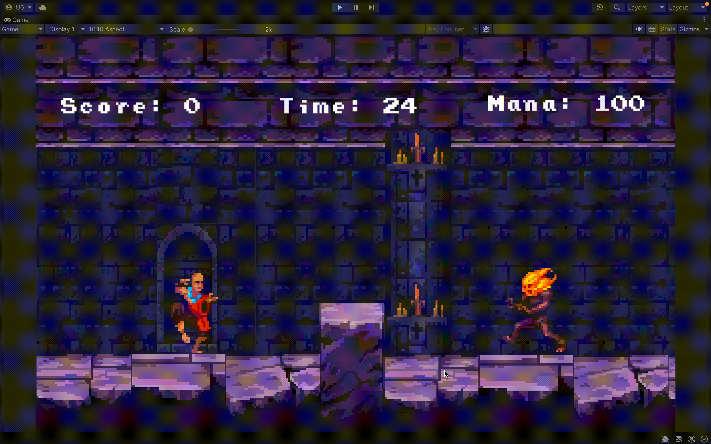

# **CASTLE OF THE DEAD**

| Name       | Umang Sanjeev Gupta |
| ---------- |---------------------|
| Student ID | 1005393             |

## Basic Game Description

### Genre: Platformer Action Game

### Main Objective: 
Escape the castle by tackling various haunted beings. Killing them, earns you points, but you have limited time to escape, better hurry!

### Game Executable

https://drive.google.com/file/d/1lujtj3xduDZ3cUGim9ck1FTmdLdnVoCb/view?usp=share_link

**State system requirements: Windows, macOS, etc**

Provide a **link** to download your game executable

### How to Play

| S.NO | Move        | Control                  |
|------|-------------|--------------------------|
| 1    | Jump        | W or Up arrow            |
| 2    | Double Jump | Long press W or Up arrow |
| 3    | Move right  | D or Right arrow         |
| 4    | Move left   | A or Left arrow          |
| 5    | Kick        | Z                        |
| 6    | Punch       | X                        |

1. Kick and punch uses mana, the player begins with 100 mana
2. Each time the player uses kick of punch they lose 30 mana points
3. Mana periodically replenishes in values of 10

### Gameplay Video
https://youtu.be/TNpbHe7TeA0

A ~60s recorded run of your game from start to finish (you may record from Unity editor, show your Game window clearly). You may provide a **working link, or a gif embedded directly here.**

## Features Implementation

Fill up the table below based on the **features** that you want us to grade you with. You may implement more features than what you can afford as your feature points, so you can select the features that we can grade. Feature prerequisite rule should apply.

You are free to transform the table below into short paragraphs if you’d like. The goal is to ensure that we **can find** and **confirm** each node implementation.

| Node ID | Color  | Short Description of Implementation                                                                                                                                                                      | Feature Point Cost | Marks to earn |
|---------|--------|----------------------------------------------------------------------------------------------------------------------------------------------------------------------------------------------------------|--------------------|---------------|
| 1       | Black  | Set up the main camera starting position accordingly for your game.                                                                                                                                      | 0                  | 0             |
| 2       | Black  | Character is controllable via input with at least 3 different actions                                                                                                                                    | 0                  | 0             |
| 3       | Black  | Produce a runnable game (export as executable) with 2 or more scene transitions                                                                                                                          | 0                  | 0             |
| 4       | Black  | README or documentation to describe the main game concept, genre, and features implemented                                                                                                               | 0                  | 0             |
| 5       | White  | Camera follows or observes the player as they move within the game                                                                                                                                       | 1                  | 3             |
| 7       | White  | Arrange objects to form a basic level with platforms, stairs, blocks, ground, or more for character navigation (~30s)                                                                                    | 1                  | 3             |
| 16      | White  | Implement at least 2 character-specific offensive action                                                                                                                                                 | 1                  | 3             |
| 19      | White  | Design and create a basic enemy prefab                                                                                                                                                                   | 1                  | 3             |
| 23      | White  | Create a 2D canvas with at least 2 UI elements                                                                                                                                                           | 1                  | 3             |
| 32      | White  | Create at least 1 ScriptableObject for holding game constants                                                                                                                                            | 1                  | 3             | |                    | 3             |
| 34      | White  | Variable, function, and class naming makes sense for >80% of your codebase                                                                                                                               | 1                  | 3             |
| 36      | White  | Commits follows proper conventional commit convention                                                                                                                                                    | 1                  | 3             |
| 39      | Orange | Create another enemy type, complete with offensive or defensive actions and movement                                                                                                                     | 2                  | 10            |
| 44      | Orange | Set up basic combat interactions between character and enemies, or opponents, or any form of non-static obstacles. Must cover at least 2 types of actions (defense or offense) and combat cost resources | 2                  | 10            |
| 45      | Orange | Utilises the Input System for handling basic input actions to control the player (ALL)                                                                                                                   | 2                  | 10            |
| 56      | Orange | Have proper audio feedback for >90% of player actions and events                                                                                                                                         | 2                  | 10            |
| 59      | Pink   | Create a timer to add a time based challenge to the game. Timer available as UI                                                                                                                          | 3                  | 15            |
| 71      | Pink   | Adopt modular design patterns for code organization for at least 10+ scripts                                                                                                                             | 3                  | 15            |
| 74      | Pink   | Utilised the Scriptable Object Game Architecture: multiple events and event listeners for >90% of game functionality                                                                                     | 3                  | 15            |

**Total Feature Point spent:** 25

**Maximum Marks to earn:** 109

### Feature Tree Visual Representation

Download the feature tree image and indicate the nodes that you have implemented. Display an image of your completed feature tree here, highlight or circle the **nodes** that you have implemented as a visual aid for us when we grade your submission

### Feature Analysis

For **each** of your **orange**, **pink** and **purple** nodes, explain clearly your game design justification on how this feature upgrades the **overall quality** of the game. In short, you’re providing a short **analysis**.

- If the feature stated that it has to support a core drive, explain which core drive.
- If the feature does not state anything concrete, it becomes an **open ended feature. Please** use proper terminologies whenever possible.
  - You can argue that this feature forms an **elegant rule**, or
  - It improves the UX of the game, or
  - **It improves code maintenance** overall
- Consult our lecture slides for inspiration and samples on how to concisely **analyse** a game.
                  

### Orange
#### Feature 39: Creating Another Enemy Type

1. Brings more diversity to the game
2. Increases challenge
3. Encourages user to think strategically

Overall, it enhanced the replaybility of the game

#### Feature 44: Set up basic combat interactions between character and enemies, or opponents, or any form of non-static obstacles. Must cover at least 2 types of actions (defense or offense) and combat cost resources

1. This is the crux of the game, as it deals with main interactions between enemy and player, without it, the game would be extremely boring and wouldn't make sense
2. Without this, the game itself, would just be about navigating in an unknown map which would not be interesting
3. Essentially, the game does not have any core mechanic unless this is implemented

#### Feature 45: Utilises the Input System for handling basic input actions to control the player (ALL)

1. Easier way to manage player and character control
2. Seprates the player controls from code, making the code more readable 
3. Implements basic interactions, which would otherwise require manual code implementation, such as long press of a particular button. In this case, we have jumphold action which occurs when you hold `W` or `Up arrow` for longer than usual

#### Feature 56: Have proper audio feedback for >90% of player actions and events

1. Makes the game more interactable
2. Different audio feedback, is another interesting way of showing the consquence of a particular action
3. Actions feel more satifactory with sounds, for example, kicking feels more normal and satisfactory when accompanied with a kicking sound, as in real life, its expected that kicking produces some sound so it makes the action more real
4. Here it is also used to express emotional elements, for example the pain sounds by player or enemy when they are killed

### Pink:

#### Feature 59: Create a timer to add a time based challenge to the game. Timer available as UI

1. A timer creates more urgency, keeping the player engaged
2. In my current game, if the player does not move, then the game will not proceed, hence the timer helps in nudging the player to progress
3. The timer is voluntarily short that it takes a few times to actually complete it within the time limit keeping the difficulty moderate

#### Feature 71: Adopt modular design patterns for code organization for at least 10+ scripts

1. Modular code helps in code redability, making future development easier
2. It helps to isolate bugs easier and faster, assisting in overall faster development of robust games
3. By Having multiple scripts to perform tasks instead of one big file, can also enhance performance

#### Feature 74: Utilised the Scriptable Object Game Architecture: multiple events and event listeners for >90% of game functionality
1. Enhanced code redability, making future development easier
2. Cross referencing of scripts, can be hard to track as well as computationally expensive operations reducing performance

## Notes

Any other notes you would like to add here

## Asset Used & Credits

It’s nice to give **credits** to the creator of the assets (if info is available).
